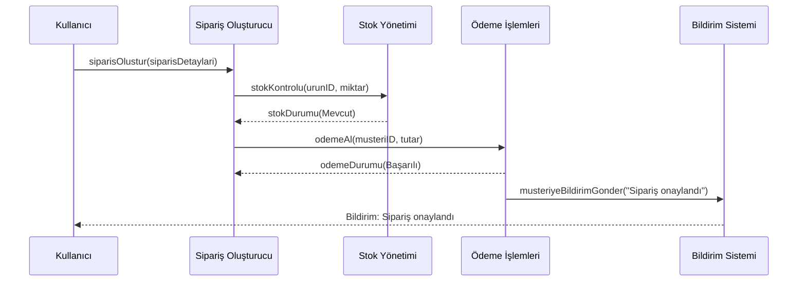

# Saga Pattern - Choreography Yaklaşımı

Bu proje, Saga Pattern'in Choreography yaklaşımını kullanarak dağıtık işlemlerin yönetimini göstermektedir.

## Proje Hakkında

Saga Pattern, dağıtık sistemlerde uzun süreli işlemleri yönetmek için kullanılan bir tasarım desenidir. Bu desen, bir işlemin birden fazla mikroservis üzerinde gerçekleştirilmesi gerektiğinde, her bir adımın başarısız olması durumunda telafi edici işlemlerin (compensating transactions) nasıl gerçekleştirileceğini tanımlar.

Choreography yaklaşımında, her bir servis kendi işini yapar ve sonucu diğer servislere bildirir. Diğer servisler bu bildirimlere tepki vererek kendi işlerini gerçekleştirir. Bu yaklaşımda merkezi bir koordinatör yoktur.

## Akış Diyagramı



## Proje Yapısı

Proje aşağıdaki bileşenlerden oluşmaktadır:

- **Entity**: Veritabanı tablolarını temsil eden sınıflar
- **Repository**: Veritabanı işlemlerini gerçekleştiren arayüzler
- **Service**: İş mantığını içeren servis sınıfları
- **Controller**: HTTP isteklerini karşılayan REST API sınıfları
- **DTO**: Veri transfer nesneleri
- **Exception**: Özel hata sınıfları

## Başlangıç

### Gereksinimler

- Java 17
- Maven
- Spring Boot 3.x

### Kurulum

1. Projeyi klonlayın:
```bash
git clone https://github.com/yourusername/saga-pattern.git
```

2. Proje dizinine gidin:
```bash
cd saga-pattern/choreography
```

3. Maven ile projeyi derleyin:
```bash
mvn clean install
```

4. Uygulamayı çalıştırın:
```bash
mvn spring-boot:run
```

Uygulama varsayılan olarak 8080 portunda çalışacaktır. Swagger UI'a erişmek için tarayıcınızda `http://localhost:8080/choreography/swagger-ui.html` adresini ziyaret edebilirsiniz.

## API Kullanımı

### Sipariş Oluşturma

```http
POST /choreography/api/orders
Content-Type: application/json

{
  "customerId": 1,
  "productId": 1,
  "quantity": 2
}
```

### Sipariş Sorgulama

```http
GET /choreography/api/orders/{id}
```

### Stok Kontrolü

```http
POST /choreography/api/stocks/check
Content-Type: application/json

{
  "orderId": 1,
  "productId": 1,
  "quantity": 2
}
```

### Ödeme İşlemi

```http
POST /choreography/api/payments/process
Content-Type: application/json

{
  "orderId": 1,
  "customerId": 1,
  "amount": 100.00
}
```

### Bildirim Gönderme

```http
POST /choreography/api/notifications
Content-Type: application/json

{
  "customerId": 1,
  "message": "Siparişiniz onaylandı",
  "type": "ORDER_CONFIRMED"
}
```

## Lisans

Bu proje MIT lisansı altında lisanslanmıştır. Detaylar için [LICENSE](LICENSE) dosyasına bakınız. 