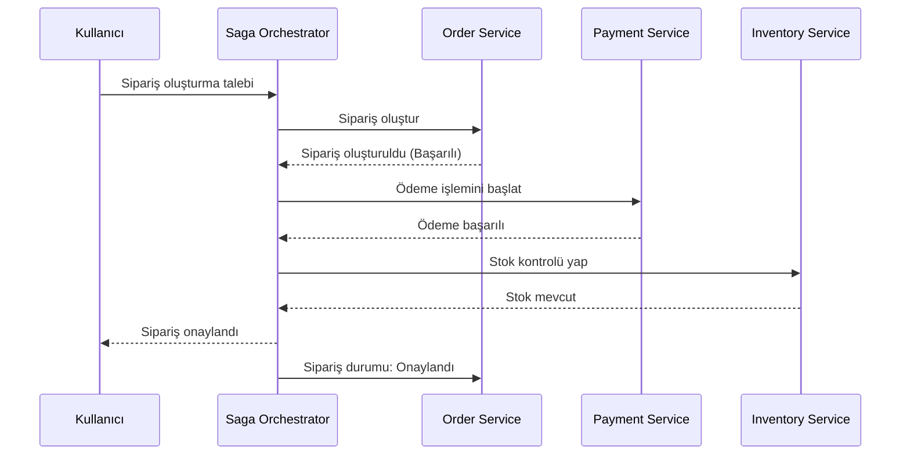

# Saga Pattern Orchestration Service

Bu proje, mikroservis mimarisinde Saga Pattern Orchestration yaklaşımını kullanarak dağıtık işlemleri yönetmek için geliştirilmiştir.

## Proje Hakkında

Saga Pattern, mikroservis mimarisinde dağıtık işlemleri yönetmek için kullanılan bir tasarım desenidir. Bu desen, birden fazla mikroservis arasında tutarlılığı sağlamak için kullanılır. İki temel yaklaşımı vardır:

1. **Koreografi (Choreography)**: Her servis bir olaya tepki verir ve kendi işlemlerini gerçekleştirir.
2. **Orkestrasyon (Orchestration)**: Merkezi bir servis (Orchestrator), tüm işlemleri koordine eder.

Bu projede Orkestrasyon yaklaşımı kullanılmıştır.

## Orchestration Servisinin Rolü

Orchestration servisi, Saga Pattern'in "orkestrasyon" yaklaşımında merkezi bir rol oynar. Bu servis:

1. **İşlem Koordinasyonu**: Sipariş oluşturma, ödeme yapma ve stok güncelleme gibi dağıtık işlemleri koordine eder.
2. **Durum Takibi**: Her bir işlemin durumunu takip eder ve saga işleminin genel durumunu yönetir.
3. **Hata Yönetimi**: Herhangi bir adımda hata oluşursa, telafi edici işlemleri (compensating transactions) başlatır.
4. **Tutarlılık Sağlama**: Tüm mikroservisler arasında veri tutarlılığını sağlar.

Orchestration servisi, diğer mikroservislerle REST API'ler üzerinden iletişim kurar ve işlemlerin başarılı bir şekilde tamamlanmasını veya hata durumunda geri alınmasını sağlar.

## Mimari

Proje, aşağıdaki bileşenlerden oluşmaktadır:

- **Saga Orchestrator**: Tüm işlemleri koordine eden merkezi servis
- **Order Service**: Sipariş işlemlerini yöneten servis
- **Payment Service**: Ödeme işlemlerini yöneten servis
- **Inventory Service**: Stok işlemlerini yöneten servis

## Akış Diyagramı

## Orchestration Servisini Anlamak İçin

Orchestration servisinin rolünü daha iyi anlamak için aşağıdaki adımları izleyebilirsiniz:

1. **Kod İncelemesi**:
   - `OrchestrationServiceImpl` sınıfını inceleyin. Bu sınıf, saga işlemlerinin nasıl koordine edildiğini gösterir.
   - `createOrder` metodunu özellikle inceleyin. Bu metot, sipariş oluşturma saga işlemini başlatır ve diğer servisleri çağırır.

2. **Veritabanı Yapısı**:
   - `OrchestrationState` entity'sini inceleyin. Bu entity, saga işlemlerinin durumunu takip etmek için kullanılır.
   - H2 Console üzerinden (http://localhost:8080/h2-console) veritabanı tablolarını inceleyebilirsiniz.

3. **API Testleri**:
   - Swagger UI üzerinden (http://localhost:8080/swagger-ui.html) API'leri test edin.
   - Bir sipariş oluşturun ve saga işleminin nasıl ilerlediğini gözlemleyin.

4. **Loglama**:
   - Uygulama loglarını inceleyin. Orchestration servisi, her adımda detaylı loglar üretir.

## Teknolojiler

- Java 17
- Spring Boot 3.2.3
- Spring Data JPA
- H2 Database
- Swagger/OpenAPI
- Lombok

## API Endpoints

### Orchestration Controller (Önerilen İsim)

- `POST /api/saga/orders`: Yeni bir sipariş oluşturur
- `GET /api/saga/{sagaId}`: Saga işlem durumunu getirir
- `GET /api/saga/status/{status}`: Belirli durumdaki saga işlemlerini getirir

### Order Controller

- `GET /api/orders/{orderNumber}`: Sipariş detaylarını getirir
- `GET /api/orders/customer/{customerId}`: Müşteri siparişlerini getirir

## Kurulum ve Çalıştırma

1. Projeyi klonlayın
2. Maven ile derleyin: `mvn clean install`
3. Uygulamayı çalıştırın: `java -jar target/orchestration-1.0.0.jar`
4. Swagger UI'a erişin: http://localhost:8080/swagger-ui.html

## Hata Telafisi (Compensation)

Saga Pattern'in en önemli özelliklerinden biri, bir adımda hata oluştuğunda önceki adımları geri alabilmesidir. Bu projede, hata durumunda aşağıdaki telafi işlemleri gerçekleştirilir:

1. **Stok Güncellemesi Başarısız**: Stok güncellemesi geri alınır, ödeme iade edilir, sipariş iptal edilir.
2. **Ödeme Başarısız**: Ödeme iade edilir, sipariş iptal edilir.
3. **Sipariş Oluşturma Başarısız**: Sipariş iptal edilir.

## Postman Collection

Projeyi test etmek için kullanabileceğiniz Postman Collection'ı [buradan](./postman_collection.json) indirebilirsiniz. 